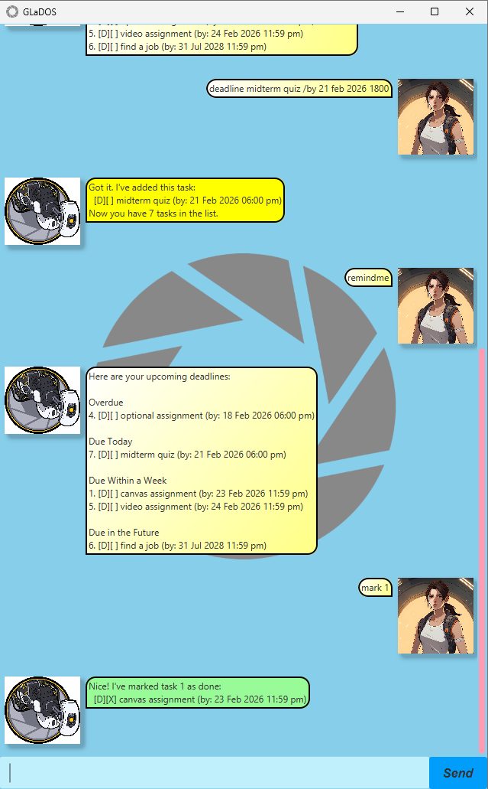

# GLaDOS User Guide

GLaDOS is a task management chatbot inspired by the Portal character. It helps you track todos, deadlines, and events with a touch of Aperture Science charm.

## Quick Start

1. Ensure you have Java `17` or above installed in your Computer.
2. Download the latest `.jar` file from [here](https://github.com/EnderSky/ip/releases)
3. Copy the file to the folder you want to use as the _home folder_ for your GLaDOS chatbot.
4. Open a command terminal, `cd` into the folder you put your jar file in.
5. Use the command `java -jar glados.jar` to run the application.
6. Type `help` to see all available commands at any time.

## Sample UI


## Features

### Adding a Todo: `todo`

Add a simple task without any date or time.

Example: `todo read book`

```
Got it. I've added this task:
  [T][ ] read book
Now you have 1 task in the list.
```

### Adding a Deadline: `deadline`

Add a task with a due date and time. Deadlines help you track when things need to be completed.

Example: `deadline submit assignment /by 25/12/2024 6:00 PM`

```
Got it. I've added this task:
  [D][ ] submit assignment (by: 25 Dec 2024 06:00 PM)
Now you have 2 tasks in the list.
```

**Supported date/time formats:**
- `25/12/2024 6:00 PM` (DD/MM/YYYY HH:MM AM/PM)
- `25/12/2024 1800` (DD/MM/YYYY HHMM)
- `2024-12-25 6:00 PM` (YYYY-MM-DD HH:MM AM/PM)
- `25 Dec 2024 6:00 PM` (DD MMM YYYY HH:MM AM/PM)

### Adding an Event: `event`

Add a task with start and end times.

Example: `event project meeting /from Monday 2pm /to Monday 4pm`

```
Got it. I've added this task:
  [E][ ] project meeting (from: Monday 2pm to: Monday 4pm)
Now you have 3 tasks in the list.
```

### Viewing All Tasks: `list`

Display all your tasks with their numbers, types, and statuses.

Example: `list`

```
Here are the tasks in your list:
1. [T][ ] read book
2. [D][ ] submit assignment (by: 25 Dec 2024 06:00 PM)
3. [E][ ] project meeting (from: Monday 2pm to: Monday 4pm)
```

### Marking Tasks as Done: `mark`

Mark a task as completed. Use the task number from the list.

Example: `mark 1`

```
Nice! I've marked this task as done:
  [T][X] read book
```

### Unmarking Tasks: `unmark`

Mark a completed task as not done.

Example: `unmark 1`

```
OK, I've marked this task as not done yet:
  [T][ ] read book
```

### Deleting Tasks: `delete`

Remove a task from your list permanently.

Example: `delete 1`

```
Noted. I've removed this task:
  [T][ ] read book
Now you have 2 tasks in the list.
```

### Finding Tasks: `find`

Search for tasks containing a specific keyword.

Example: `find meeting`

```
Here are the matching tasks in your list:
1. [E][ ] project meeting (from: Monday 2pm to: Monday 4pm)
```

### Getting Deadline Reminders: `remindme`

View all incomplete deadlines organized by urgency.

Example: `remindme`

```
Here are your upcoming deadlines:

Overdue:
  [D][ ] submit report (by: 20 Dec 2024 06:00 am)

Due Today:
  [D][ ] finish homework (by: 23 Dec 2024 11:59 pm)

Due Within a Week:
  [D][ ] submit assignment (by: 25 Dec 2024 06:00 pm)

Due in the Future:
  [D][ ] final exam (by: 15 Jan 2025 09:00 am)
```

### Getting Help: `help`

Display all available commands and their syntax.

Example: `help`

### Exiting the Application: `bye`

Close GLaDOS when you're done.

Example: `bye`

```
Goodbye. Thank you for participating in this Aperture Science test.
Remember, the cake is a lie.
```

## Command Summary

| Command | Format | Example |
|---------|--------|---------|
| Add Todo | `todo DESCRIPTION` | `todo read book` |
| Add Deadline | `deadline DESCRIPTION /by DATE_TIME` | `deadline submit report /by 25/12/2024 6:00 PM` |
| Add Event | `event DESCRIPTION /from START /to END` | `event meeting /from 2pm /to 4pm` |
| List Tasks | `list` | `list` |
| Mark Task | `mark TASK_NUMBER` | `mark 1` |
| Unmark Task | `unmark TASK_NUMBER` | `unmark 1` |
| Delete Task | `delete TASK_NUMBER` | `delete 1` |
| Find Tasks | `find KEYWORD` | `find meeting` |
| View Reminders | `remindme` | `remindme` |
| Help | `help` | `help` |
| Exit | `bye` | `bye` |

## Additional Info

### Task Status Indicators

- `[ ]` - Task not completed
- `[X]` - Task completed

### Task Type Indicators

- `[T]` - Todo
- `[D]` - Deadline
- `[E]` - Event

---
